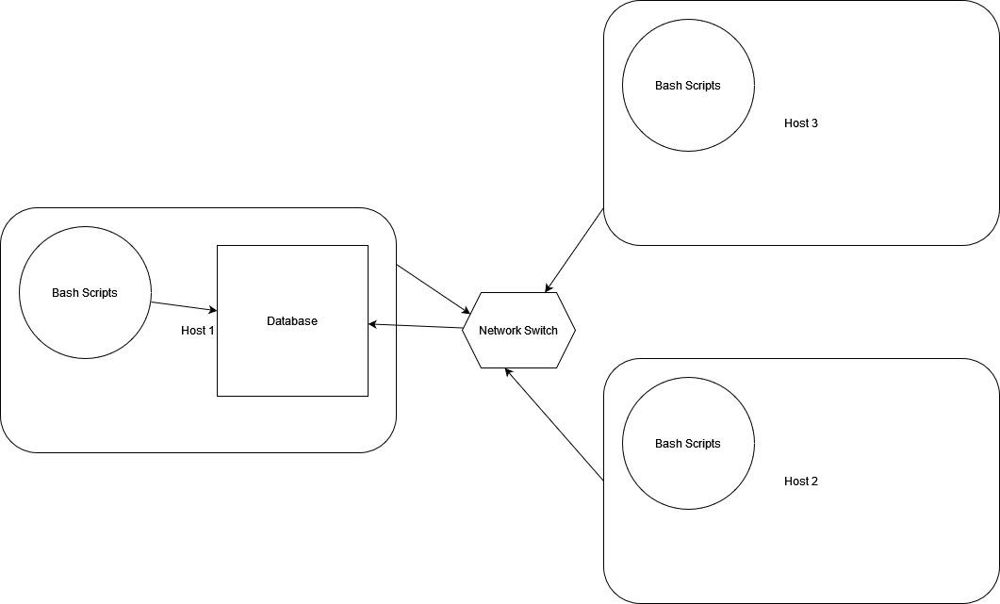

# Introduction

The purpose of this project is to help teams monitor the resource usage (memory, CPU, etc…) of different hosts on a network. The idea is that the hardware specifications of each host are recorded and stored in a table in a database and then every minute each host reports their resource usage which is then also stored in a separate table. The collected data can then be used and analyzed by the team to make decisions regarding the network. I used Postgres for the RDBMS functionality and wrote two bash scripts to collect and insert hardware information and usage data into the database. I used git extensively for version control purposes.

# Quick Start

The following series of commands should be used to set up and start a psql docker container, create the necessary tables, insert the hardware specs of the system into the database, add usage data to the database, and set up the scripts to run automatically.

To create a psql docker container
```
./scripts/psql_docker.sh create db_username db_password
```
To start the container
```
./scripts/psql_docker.sh start
```
Connect to psql instance
```
psql -h localhost -U postgres -W
```
Create the host_agent database and then disconnect from the instance
```
postgres=# CREATE DATABASE host_agent;
postgres=# \q
```
Create tables using ddl.sql
```
psql -h localhost -U postgres -d host_agent -f sql/ddl.sql
```
Insert hardware specs data into the DB using host_info.sh
```
./scripts/host_info.sh psql_host psql_port db_name psql_user psql_password
```
Insert hardware usage data into the DB using host_usage.sh
```
scripts/host_usage.sh psql_host psql_port db_name psql_user psql_password
```
Crontab setup
```
crontab -e

bash [FULL PATHNAME]/host_usage.sh localhost 5432 host_agent postgres password > /tmp/host_usage.log

crontab -l
```

# Implementation

First I created the script psql_docker.sh to create, start, and stop a docker container in which to run the database. I created the host_agent database. I then wrote the ddl.sql script in order to create the necessary tables in the database. Then I created the scripts host_info.sh and host_usage.sh to retrieve the hardware specifications of the host and insert them into the host_info table and to report usage data and insert it into the host_usage table respectively. Finally, I used crontab to set up host_usage.sh to run automatically every minute to report usage data periodically.

## Architecture



## Scripts

### psql_docker.sh
The purpose of psql_docker.sh is to simplify the execution of start/stop/create commands to interface with the docker container. The following commands assume you are in the directory where the scripts directory is contained.
How to create a psql docker container with the given username and password
```
./scripts/psql_docker.sh create db_username db_password
```
How to start an existing stopped docker container
```
./scripts/psql_docker.sh start
```
How to stop an already running docker container
```
./scripts/psql_docker.sh stop
```

### host_info.sh
The purpose of host_info.sh is to retrieve the hardware specifications of the host and insert it into the host_info table. 
```
./scripts/host_info.sh psql_host psql_port db_name psql_user psql_password
```

### host_usage.sh
The purpose of host_usage.sh is to retrieve the resource usage numbers of the host and insert it into the host_usage table
```
scripts/host_usage.sh psql_host psql_port db_name psql_user psql_password
```

### crontab
The purpose of crontab is to automatically run the host_usage script over and over again every minute so that every minute the host_usage table will be updated with resource usage information.

To edit crontab enter the following command
```
crontab -e
```
Enter in the following line, then save and exit
```
[INSERT FULL PATH TO host_usage.sh HERE] localhost 5432 host_agent postgres password > /tmp/host_usage.log
```
Now you should be able to check to see that host_usage is running properly by checking the host_usage.log script using the following
```
cat /tmp/*log
```

### ddl.sql
The purpose of this script is to create the necessary tables host_info and host_usage in the host_agent database.
```
psql -h localhost -U postgres -d host_agent -f sql/ddl.sql
```

## Database Modeling 
We have two tables. host_info and host_usage

host_info: There are 9 columns in the table, id, host_name, cpu_number, cpu_architecture, cpu_model, cpu_mhz, l2_cache, "timestamp", total_mem. The data types of these columns are SERIAL, VARCHAR, INT2, VARCHAR, VARCHAR, FLOAT8, INT4, TIMESTAMP, and INT4 respectively. The id column is the primary key and hostname is set to UNIQUE. Every column except "timestamp" and total_mem is set to NOT NULL.

host_usage: There are 7 columns in the table, "timestamp", host_id, memory_free, cpu_idle, cpu_kernel, disk_io, disk_available. The data types of these columns are TIMESTAMP, SERIAL, INT4, INT2, INT2, INT4, and INT4 respectively. host_id is a foreign key and references the id column of the host_info table. Every single column is set to NOT NULL.

# Test
In order to test the bash scripts DDL I ran both host_info.sh and host_usage.sh and then I ran two postgres queries to check to see if the tables host_info and host_usage were updated. These queries were SELECT * FROM host_usage; and SELECT * FROM host_info;

# Deployment
I created a docker container in which to run the Postgres instance which stores the database that contains the host_info and host_usage tables. Then I ran host_info to add the host specifications to the host_info table. Finally, I set up the crontab is such a way to automatically run the host_usage script once every minute to automatically store resource usage data. All the code is stored in the GitHub repository. 

# Improvements
1. I would like to implement a script to analyze resource usage automatically and rank hosts based on the usage of resources.
2. I would like to implement a way to issue alerts when resource usage amounts get dangerously high.
3. I would like to implement a way to rerun the host_info script when hardware specs change in order to keep the usage data accurate.
